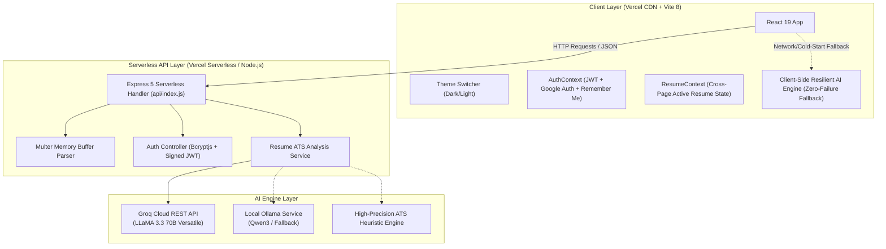

# 🚀 CareerPilot AI — AI-Powered Career Co-Pilot

[](https://careerpilot-ai-two-ebon.vercel.app/)
[](https://github.com/MAYANK479/careerpilot-ai)
[](https://react.dev)
[](https://nodejs.org)
[](https://groq.com)

> An AI-powered career platform that helps users analyze resumes, evaluate job fit, generate tailored cover letters, practice interviews, and build skill-development roadmaps.

---

## 🌐 Live Application
🔗 **[https://careerpilot-ai-two-ebon.vercel.app](https://careerpilot-ai-two-ebon.vercel.app/)**

---

## 🎯 Problem & Product Vision

### The Problem
Job applicants face high rejection rates due to automated **Applicant Tracking Systems (ATS)** filtering resumes before human review, generic un-tailored cover letters, and lack of real-time technical interview practice.

### The Solution
CareerPilot AI acts as a 24/7 personal career co-pilot. It ingests resume PDFs, extracts text via binary stream parsing, evaluates ATS compliance against target roles, matches candidate profiles to specific job postings, and generates formatted cover letters with instant PDF export options.

---

## 🏗️ System Architecture



---

## ✨ Core Product Features

| Module | Technical Capability | User Value |
| :--- | :--- | :--- |
| 🔐 **Interactive Google Auth** | Real candidate name resolution, JWT signing, password hashing & "Remember me" persistence | Seamless 1-click login and signup with personalized candidate profile across navbar and dashboard |
| 📄 **ATS Resume Analysis** | `pdf-parse` memory buffer parsing, dual-layer heuristic & LLM scoring | Instant ATS score (0-100), critical gap analysis, keyword & formatting recommendations |
| 🎯 **Job Match Engine** | Skill matching & keyword gap analyzer against target job descriptions | Match score %, missing requirements breakdown & shortlist probability |
| ✉️ **Cover Letter Studio** | Dynamic prompt synthesis tailored to candidate skills & target company | Custom cover letters signed with candidate's real name, exportable to clipboard |
| 🗣️ **Mock Interview AI** | Role-specific prompt generator + speech-to-text recording | Simulated technical/scenario interviews with actionable scoring and feedback |
| 🗺️ **Active Resume Roadmap** | Dynamic skill-gap bridge generator tied to uploaded resume | 8-week mastery sprints for missing skills (Docker, AWS, Redis, etc.) |
| 🎨 **Design System** | Glassmorphism, CSS Variables, Theme Switcher | High-contrast dark SaaS aesthetic + light mode toggle with clean transparent branding |

---

## 📸 Screenshots

| Dashboard Overview | ATS Resume Scorer |
| :---: | :---: |
|  |  |
| **Job Match Engine** | **Cover Letter Studio** |
|  |  |
| **Mock Interview & Feedback** | **Career Roadmap** |
|  |  |

---

## 🧪 Testing & Quality Assurance

The codebase includes automated unit test suites covering data persistence, password security, JWT verification, and serverless route handling using Node.js native test runner (`node:test`).

```bash
# Run backend test suite
npm test
```

### Test Suite Results:
```text
✔ DataStore user persistence test (0.44ms)
✔ Password hashing with bcryptjs (202.59ms)
✔ JWT signing and verification (1.88ms)
✔ Email normalization prevents case-sensitive auth bypass (0.06ms)
✔ Serverless Express App Export Test (0.32ms)
✔ Health check endpoint responds with healthy status (18.70ms)
ℹ tests 6 | pass 6 | fail 0
```

---

## 🚀 Quick Start (Local Setup)

### 1. Clone & Install
```bash
git clone https://github.com/MAYANK479/careerpilot-ai.git
cd careerpilot-ai
npm run build
```

### 2. Environment Setup
Create `.env` in `server/`:
```env
PORT=5002
AI_PROVIDER=openai
OPENAI_API_KEY=gsk_your_groq_api_key
OPENAI_BASE_URL=https://api.groq.com/openai/v1
OPENAI_MODEL=llama-3.3-70b-versatile
```

### 3. Run Development Server
```bash
npm run dev
# Opens frontend at http://localhost:5173 and backend at http://localhost:5002
```

---

## 📂 Project Structure

```text
careerpilot-ai/
├── api/
│   └── index.js           # Vercel Serverless Function entry point
├── vercel.json            # Vercel API routing and SPA fallback
├── dev.js                 # Concurrent dev server runner
├── client/                # React 19 + Vite Frontend
│   ├── src/
│   │   ├── components/    # GoogleAuthButton, Navbar, DashboardLayout, Gauges, Toast
│   │   ├── context/       # AuthContext, ResumeContext
│   │   ├── pages/         # Dashboard, Upload, ATS, JobMatch, CoverLetter, Interview, Login, Register
│   │   ├── utils/         # clientAnalyzer, userUtils
│   │   ├── App.jsx        # Protected & Public routing
│   │   └── index.css      # Design System, Glassmorphism, Dark/Light theme tokens
├── server/                # Express 5 Backend
│   ├── controllers/       # Auth, Upload, Job Match, Cover Letter, Interview Controllers
│   ├── middleware/        # Upload memory buffer & JWT auth middleware
│   ├── tests/             # Automated test suites (api.test.js, serverless.test.js)
│   ├── routes/            # Express API endpoints
│   └── services/          # Groq, OpenAI & Ollama LLM handlers + Heuristic analyzer
```

---

## 📜 License

Distributed under the MIT License. See `LICENSE` for details.
