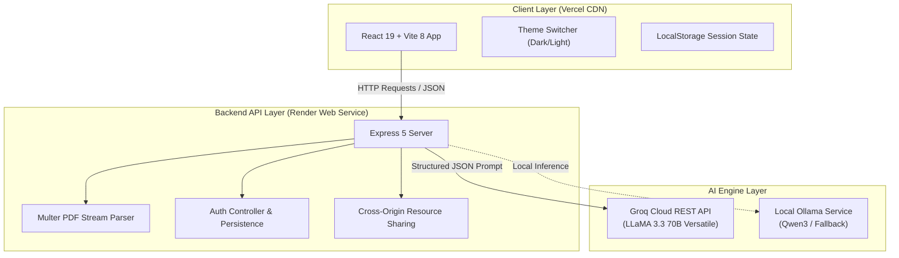
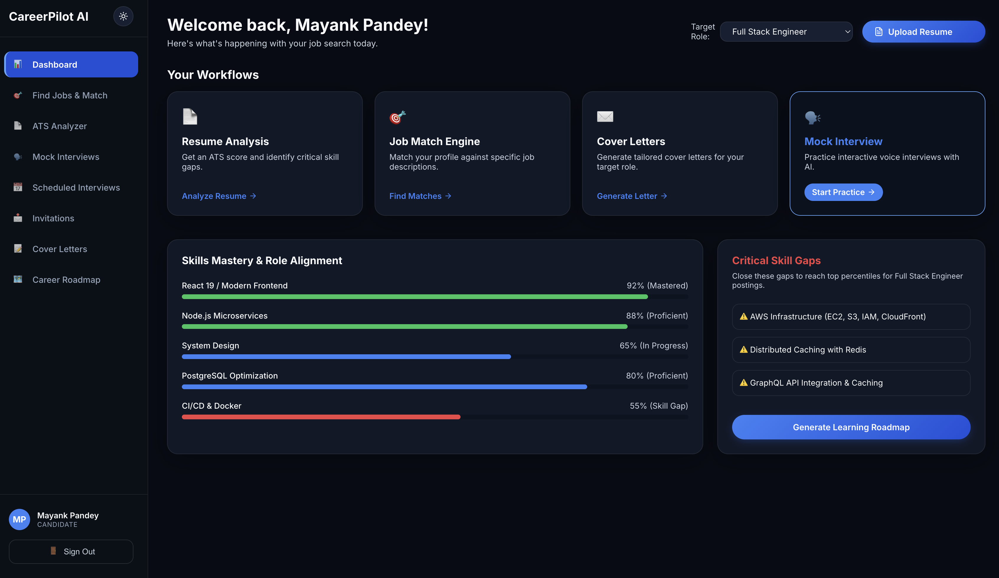
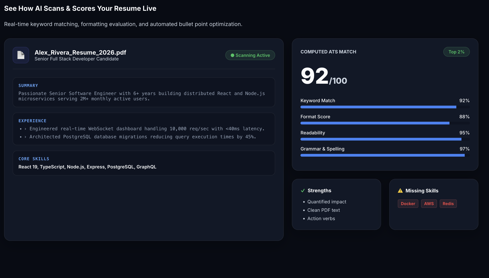
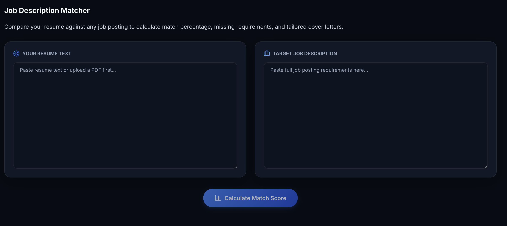
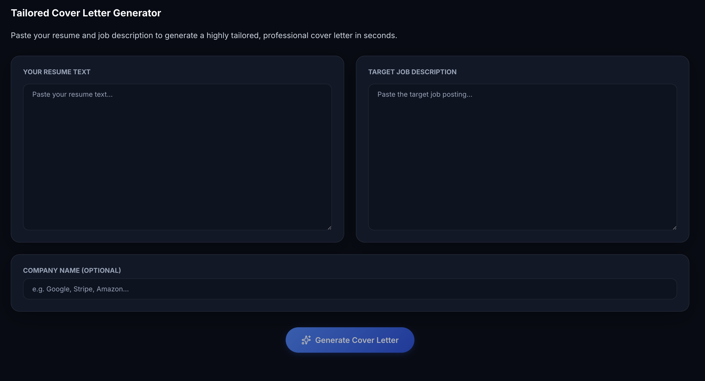
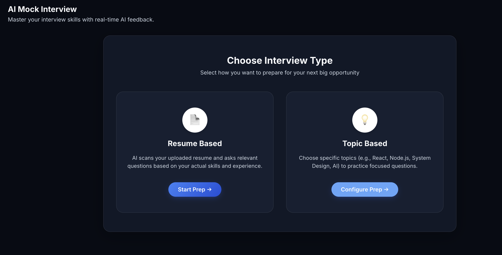
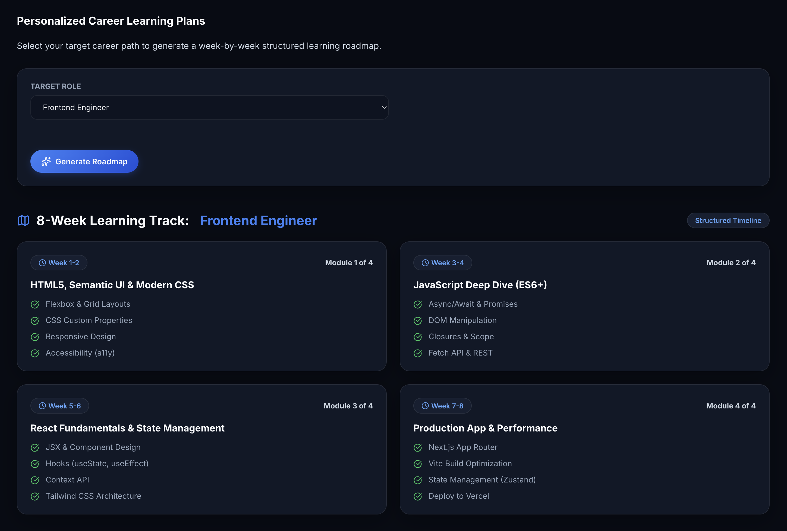

# 🚀 CareerPilot AI — AI-Powered Career Co-Pilot

[](https://careerpilot-ai-two-ebon.vercel.app/)
[](https://github.com/MAYANK479/careerpilot-ai)
[](https://react.dev)
[](https://nodejs.org)
[](https://groq.com)

> An AI-powered career platform that helps users analyze resumes, evaluate job fit, generate tailored cover letters, practice interviews, and build skill-development roadmaps.

---

## 🌐 Live Application
🔗 **[https://careerpilot-ai-two-ebon.vercel.app](https://careerpilot-ai-two-ebon.vercel.app/)**

---

## 🎯 Problem & Product Vision

### The Problem
Job applicants face high rejection rates due to automated **Applicant Tracking Systems (ATS)** filtering resumes before human review, generic un-tailored cover letters, and lack of real-time technical interview practice.

### The Solution
CareerPilot AI acts as a 24/7 personal career co-pilot. It ingests resume PDFs, extracts text via binary stream parsing, evaluates ATS compliance against target roles, matches candidate profiles to specific job postings, and generates formatted cover letters with instant PDF export options.

---

## 🏗️ System Architecture



---

## ✨ Core Product Features

| Module | Technical Capability | User Value |
| :--- | :--- | :--- |
| 📄 **ATS Resume Analysis** | `pdf-parse` binary stream extraction & LLM skill evaluation | Instant ATS score (0-100), critical gap analysis & formatting tips |
| 🎯 **Job Match Engine** | Vector keyword overlap & job posting criteria scoring | Shortlist probability & missing skill identification |
| ✉️ **Cover Letter Studio** | Dynamic prompt synthesis + HTML print-to-PDF pipeline | Custom cover letters exportable in both `.txt` and formatted `.pdf` |
| 🗣️ **Mock Interview AI** | Interactive prompt turn-taking & evaluation | Simulated role interviews with constructive feedback |
| 🗺️ **Career Roadmap** | Dynamic checklist generator & mastery progress | Step-by-step skill gap mitigation track |
| 🎨 **Design System** | Glassmorphism, CSS Variables, Theme Switcher | High-contrast dark SaaS aesthetic + light mode toggle |

---

## 📸 Screenshots

| Dashboard Overview | ATS Resume Scorer |
| :---: | :---: |
|  |  |
| **Job Match Engine** | **Cover Letter Studio** |
|  |  |
| **Mock Interview & Feedback** | **Career Roadmap** |
|  |  |

---

## 🧪 Testing & Quality Assurance

The codebase includes automated unit test suites covering data persistence and authentication logic using Node.js native test runner (`node:test`).

```bash
# Run backend test suite
npm test
```

### Sample Output:
```text
✔ DataStore user persistence test (0.72ms)
✔ Auth logic test - User registration structure validation (0.09ms)
ℹ tests 2 | pass 2 | fail 0
```

---

## 🚀 Quick Start (Local Setup)

### 1. Clone & Install
```bash
git clone https://github.com/MAYANK479/careerpilot-ai.git
cd careerpilot-ai
npm run build
```

### 2. Environment Setup
Create `.env` in `server/`:
```env
PORT=5002
AI_PROVIDER=openai
OPENAI_API_KEY=gsk_your_groq_api_key
OPENAI_BASE_URL=https://api.groq.com/openai/v1
OPENAI_MODEL=llama-3.3-70b-versatile
```

### 3. Run Development Server
```bash
npm run dev
# Opens frontend at http://localhost:5173 and backend at http://localhost:5002
```

---

## 📂 Project Structure

```text
careerpilot-ai/
├── vercel.json            # Vercel Single-Page-App routing rewrites
├── dev.js                 # Concurrent dev server runner
├── client/                # React 19 + Vite Frontend
│   ├── src/
│   │   ├── components/    # Navigation, Layouts, Gauges, Skill Chips, Toast
│   │   ├── pages/         # Dashboard, Upload, JobMatch, CoverLetter, Interview, Login, Register
│   │   ├── App.jsx        # React Router routes
│   │   └── index.css      # Custom Design System, Glassmorphism, Light/Dark themes
├── server/                # Express 5 Backend
│   ├── controllers/       # Auth, Upload, Job Match, Cover Letter, Interview Controllers
│   ├── tests/             # Automated test suite (api.test.js)
│   ├── routes/            # Express API endpoints
│   └── services/          # Groq, OpenAI & Ollama LLM handlers
```

---

## 📜 License

Distributed under the MIT License. See `LICENSE` for details.
